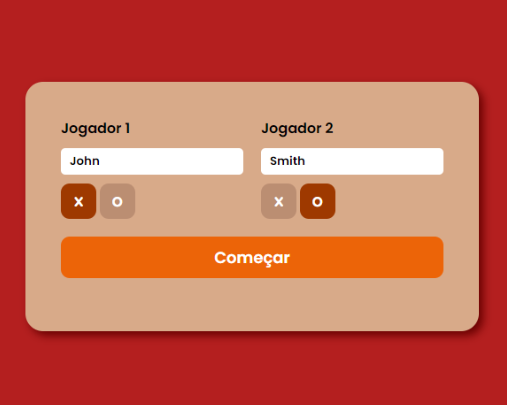
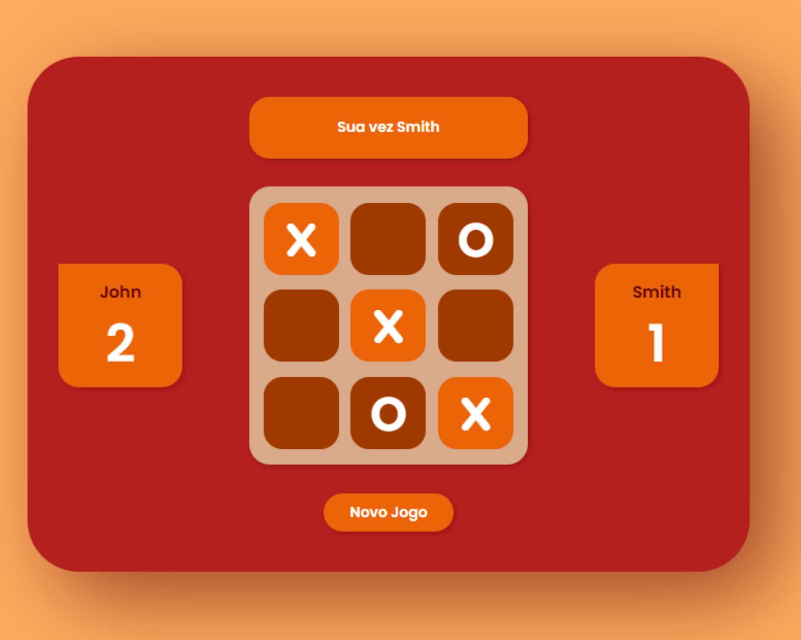
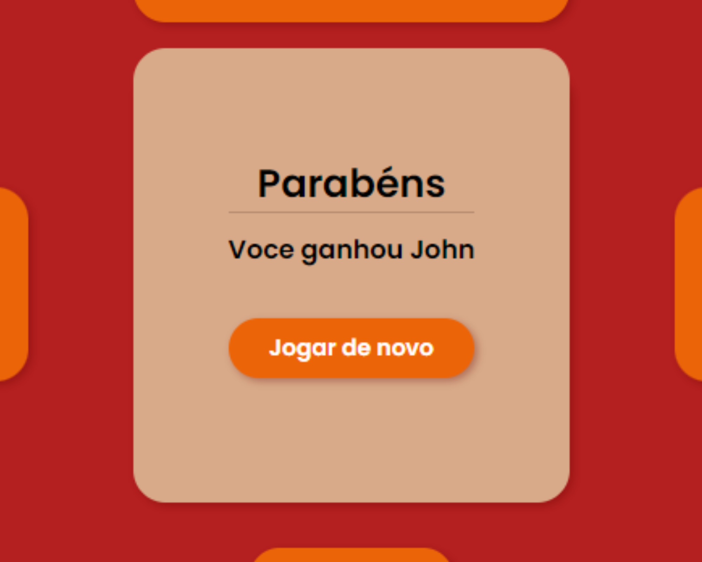

## Access the Project

https://renancardosodev.github.io/tic-tac-toe/

## Description

This is a Tic Tac Toe game project developed in HTML, CSS, and JavaScript. The goal is to create an intuitive and responsive user interface for collecting player registration information.

## Features

- **Registration Fields:**
  - Player 1 Name
  - Player 2 Name

- **Symbol Choice:**
  - Players choose between 'X' or 'O' to start the game.

- **Gameplay:**
  - The game starts with the choice of symbols.
  - The game identifies the winner or if it's a draw (cat's game).
  - The score is updated after each game.

- **Restart Game:**
  - Players have the option to restart the game for a new match.

- **Score Visualization:**
  - The accumulated score of each player is displayed to view the win history.

- **Data Validation:**
  - Verification of filled registration fields.

- **Responsive Design:**
  - Adaptation to different screen sizes for a consistent experience on mobile devices and desktops.

- **Technologies Used:**
  - HTML / CSS / JavaScript

## How to Contribute

If you want to contribute to the development of this project, follow the steps below:

1. Fork the repository.
2. Clone the forked repository to your local environment.
3. Create a branch for your contribution: `git checkout -b your-branch-name`.
4. Make desired changes to the code.
5. Commit the changes: `git commit -m "Description of changes"`.
6. Push to the branch: `git push origin your-branch-name`.
7. Open a Pull Request in the original repository.

## Game Rules

- Each player fills their name in the registration fields.
- Players choose between 'X' or 'O' to start the game.
- The game continues until one player wins or there's a draw (cat's game).
- Points are accumulated for each player based on wins.

## Screenshots

## Development Environment

Make sure to have a development environment set up with a compatible web browser. We recommend using VSCode as the code editor.

# Author

Renan Cardoso da Silva

[LinkedIn](https://www.linkedin.com/in/renancardosodev)